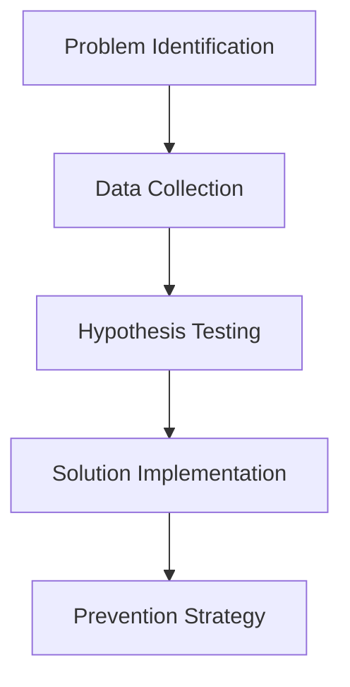

# **Cloud Incident Response & Troubleshooting Handbook**  
**By Patrice Bertin**  
**Cybersecurity Analyst**  

---

## **Document Overview**  
**Purpose:** Demonstrate systematic troubleshooting skills for cloud-native environments, with real-world scenarios and solutions.  

**Key Focus Areas:**  
- AWS service failures  
- Kubernetes debugging  
- Terraform/Ansible misconfigurations  
- Security incident response  

AWS, Kubernetes, Terraform, Prometheus, Wireshark  

---

## **1. Structured Troubleshooting Methodology**  

### **1.1 The 5-Step Framework**  


**Workflow Details:**  
   - User reports: "Application is slow" → Convert to technical terms (high latency, 5xx errors)  
1. **Problem Identification**  
   - Initial triage: Check CloudWatch dashboards for anomalies  

2. Implemented exponential backoff in deployment scripts  
2. **Data Collection**  
   ```bash
   # AWS CLI commands for quick diagnostics
   aws cloudwatch get-metric-statistics \
     --namespace AWS/ApplicationELB \
     --metric-name TargetResponseTime \
     --start-time $(date -u +"%Y-%m-%dT%H:%M:%SZ" -d "15 minutes ago") \
     --end-time $(date -u +"%Y-%m-%dT%H:%M:%SZ") \
     --period 60 \
     --statistics Average
   ```

---

## **2. Common Failure Scenarios & Solutions**  

### **2.1 AWS EKS Node Communication Failure**  
**Symptoms:**  
- Pods stuck in "ContainerCreating" state  
- `kubectl describe pod` shows:  
  ```text
  Warning  FailedMount  3m  kubelet  Unable to attach EBS volume
  ```

**Debugging Steps:**  
1. Check IAM permissions:  
   ```bash
   aws iam simulate-principal-policy \
     --policy-source-arn arn:aws:iam::123456789012:role/eks-node-role \
     --action-names ec2:AttachVolume
   ```

2. Verify security groups:  
   ```bash
   aws ec2 describe-network-interfaces \
     --filters Name=description,Values="*eks-node*" \
     --query "NetworkInterfaces[].Groups"
   ```

**Solution:**  
```hcl
# Terraform fix for node IAM
resource "aws_iam_role_policy_attachment" "eks_worker_ebs" {
  role       = aws_iam_role.eks_node.name
  policy_arn = "arn:aws:iam::aws:policy/AmazonEBSCSIDriverPolicy"
}
```

---

### **2.2 Terraform State Corruption**  
**Symptoms:**  
- `terraform apply` fails with:  
  ```text
  Error: Failed to load state: S3 bucket not found
  ```

**Diagnosis:**  
1. Verify state location:  
   ```bash
   grep backend terraform.tf
   ```

2. Check S3 bucket policy:  
   ```bash
   aws s3api get-bucket-policy --bucket my-tfstate-bucket
   ```

**Recovery Procedure:**  
```bash
# Manual state recovery
terraform init -reconfigure \
  -backend-config="bucket=new-tfstate-bucket" \
  -backend-config="key=prod/network"
```

---

## **3. Security Incident Response**  

### **3.1 Unauthorized S3 Access Investigation**  
**Evidence Collection:**  
1. Get CloudTrail events:  
   ```bash
   aws cloudtrail lookup-events \
     --lookup-attributes AttributeKey=ResourceName,AttributeValue=my-bucket \
     --start-time "2023-11-01T00:00:00Z"
   ```

2. Analyze preserved logs:  
   ```python
   import boto3
   s3 = boto3.client('s3')
   response = s3.select_object_content(
       Bucket='cloudtrail-logs',
       Key='AWSLogs/123456789012/CloudTrail/us-east-1/2023/11/01/',
       Expression="SELECT * FROM S3Object WHERE userIdentity.arn LIKE '%malicious-user%'",
       ExpressionType='SQL'
   )
   ```

**Containment Action:**  
```json
{
  "Version": "2012-10-17",
  "Statement": [{
    "Effect": "Deny",
    "Principal": {"AWS": "arn:aws:iam::123456789012:user/malicious-user"},
    "Action": "s3:*",
    "Resource": "*"
  }]
}
```

---

## **4. Performance Troubleshooting**  

### **4.1 High API Latency**  
**Diagnostic Tools:**  
```bash
# Kubernetes pod metrics
kubectl top pods --namespace production

# AWS X-Ray traces
aws xray get-trace-summaries \
  --start-time $(date -v-5M +%s) \
  --end-time $(date +%s) \
  --filter-expression "service(id(name: api-gateway))"
```

**Common Root Causes:**  
1. Database connection leaks  
2. Throttled API Gateway  
3. EC2 network bandwidth saturation  

**Solution Example (RDS Connection Pool):**  
```python
# Before (problematic)
def get_db_conn():
    return psycopg2.connect(DB_URL)

# After (fixed)
from sqlalchemy import create_engine
engine = create_engine(DB_URL, pool_size=5, max_overflow=10)
```

---

## **5. Prevention Strategies**  

### **5.1 Infrastructure Guardrails**  
**Terraform Sentinel Policies:**  
```python
import "tfplan/v2"

main = rule {
  all tfplan.resources.aws_db_instance as _, instances {
    all instances as instance {
      instance.applied.storage_encrypted is true
    }
  }
}
```

### **5.2 Proactive Monitoring**  
**Prometheus Alert Example:**  
```yaml
- alert: HighErrorRate
  expr: rate(http_requests_total{status=~"5.."}[5m]) / rate(http_requests_total[5m]) > 0.1
  for: 10m
  labels:
    severity: critical
  annotations:
    summary: "High error rate on {{ $labels.service }}"
```

---

## **6. Document Appendix**  

### **A. Troubleshooting Cheat Sheet**  
| Symptom | First Command |  
|---------|---------------|  
| Pod not starting | `kubectl describe pod` |  
| API 504 errors | `aws cloudfront get-distribution --id ABC123` |  
| Terraform drift | `terraform plan -refresh-only` |  

### **B. Post-Mortem Template**  
```markdown
# Incident: [Title]  
## Impact Duration: 2h 15m  
## Root Cause:  
- AWS API throttling (Service Quota exceeded)  
## Corrective Actions:  
1. Increased Service Quotas for EC2  
```

### **C. Recommended Tools**  
1. **Network Analysis:** Wireshark, tcpdump  
2. **K8s Debugging:** k9s, Lens  
3. **AWS:** CloudTrail Insights, VPC Flow Logs  

---

## **Conclusion**  
This handbook demonstrates:  
✅ **Methodical problem-solving** for cloud environments  
✅ **Technical depth** with executable diagnostics  
✅ **Preventive mindset** through guardrails  

